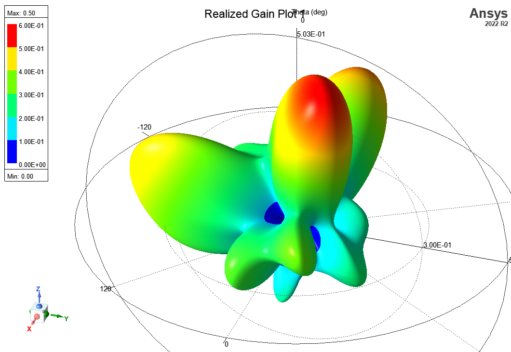

# 遠場資料表示方式

電磁輻射主要由電場(E)與磁場(H)構成。在球座標當中，可以拆解成$${\theta}跟{\phi}$$兩個方向的分輛。HFSS遠場的定義：

$$
E_{\theta}({\theta},{\phi})\\ E{\phi}({\theta},{\phi})
$$

上面公式當中，$$E_{\theta}, E{\phi}$$都是向量，以複數形式表示。括號當中的$${\theta}$$範圍為0-180度，$${\phi}$$範圍為0-360度。如果以一度為解析度，輸出資料為181\*361=65341點資料。有人會問，為什麼HFSS遠場的資料不包含H場？其實遠場的H場與E場滿足下列關係：

$$
E=Z_0H, Z_0=377({\Omega})
$$

因此只要E確定，H便可以確定。遠場的E跟H場做向量外積可以得到P(波因庭向量)：

$$
P=E\times H \ (W/m^2)
$$

P的方向是遠離原點，畫成3D圖如下：

<figure><figcaption></figcaption></figure>
